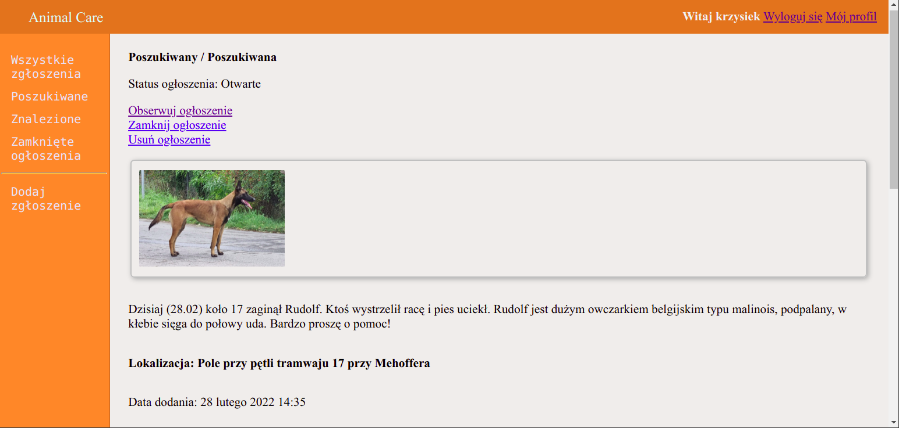

App for reporting missing animals.

App contains:
- creating accounts with e-mail activation
- changing password via link sent on e-mail
- cases lists filtered by type and/or status
- adding cases by registered users or by anonymous users
- editing cases by logged in users
- closing / deleting cases by admin
- adding cases to observed by logged in users
- adding / editing / deleting comments by logged in users
- deleting comments by admin
- tests for every view using pytest

Stack:
- Django
- HTML5
- CSS
- JavaScript
- PostgreSQL

Screenshots:
- Main Page

- Registration

- Login

- Change Password

- Profile 

- Case Adding

- Case Editing

- Cases List (All, no filter)

- Photo Zoom (photo modal)

- Case (regular user view)

- Case (admin view)

- Comment adding / editing

- Comments Section (regular user view)

- Comments Section (admin view)
